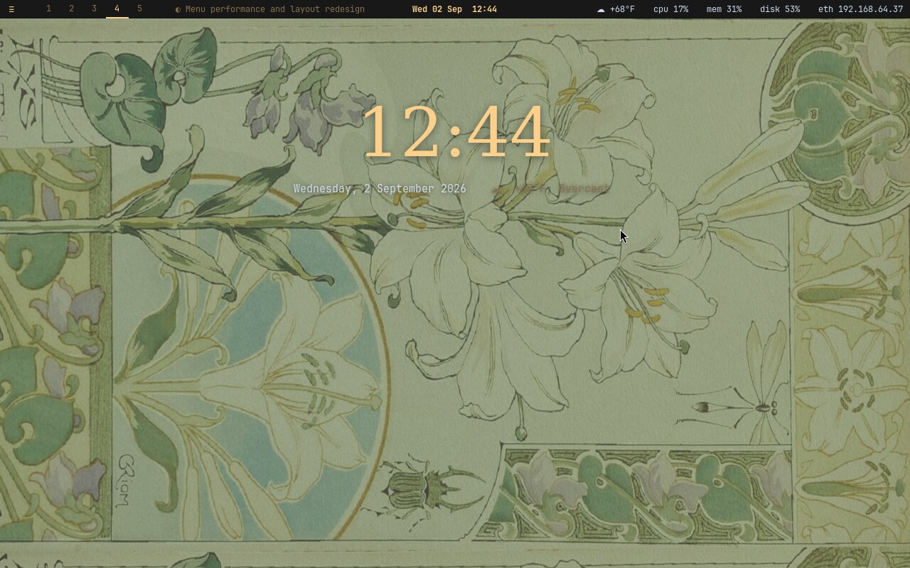
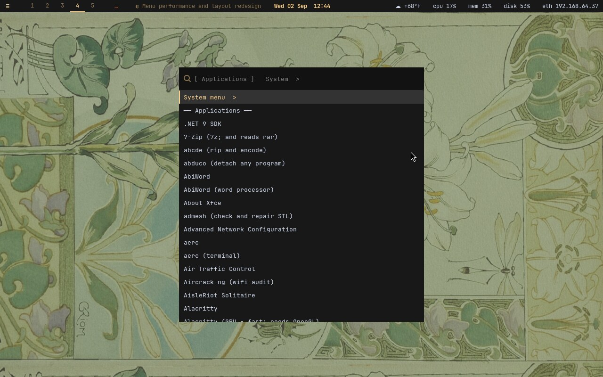
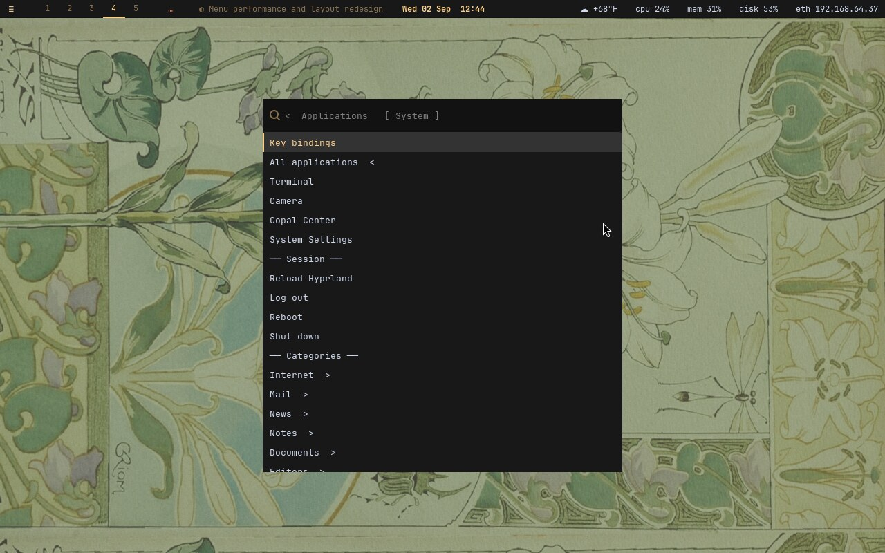
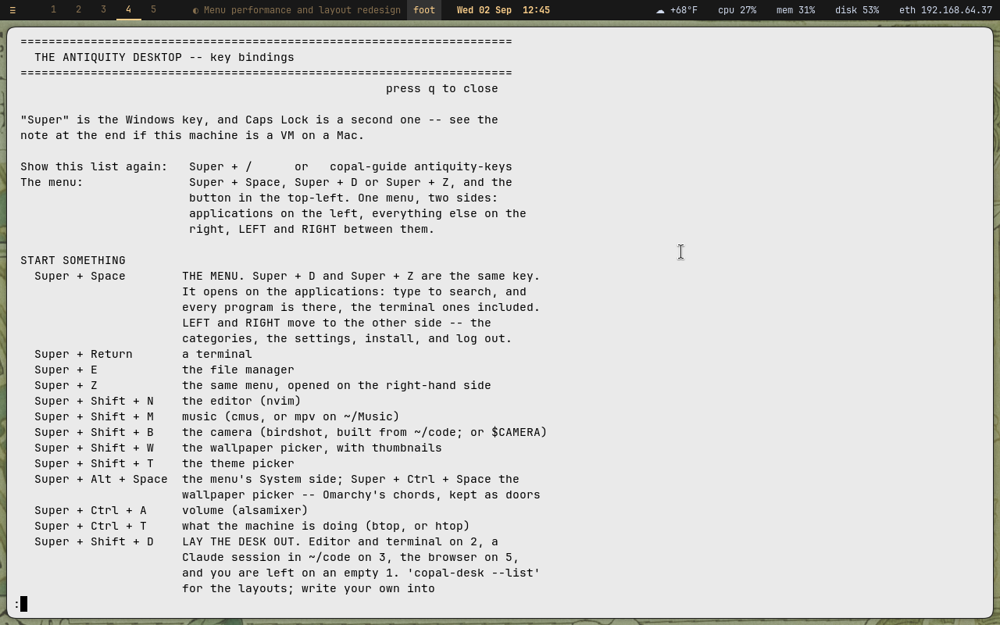

# Linux Antiquity, distilled for Copal Linux

**This is diinki's [Linux Antiquity](https://github.com/diinki/linux-antiquity),
reduced to its essence and put on a keyboard.** The look is entirely diinki's:
art nouveau and old scientific drawing, anthropomorphised suns and moons, star
charts, the four humours. What this branch does is carry that look onto
[Copal Linux](https://github.com/vonglurt/copal), which is stock Alpine on a
Raspberry Pi, a PC or a UTM guest, with no systemd, no Arch, no quickshell,
and often no GPU, and make every part of it reachable without a mouse.

Everything that remains here is upstream's work. Everything that is missing
was taken out on purpose, and this file says what and why. If you want the
theme as its author intended it, on Arch with the radial quickshell bar and
the tarot power menu, go to the [original](https://github.com/diinki/linux-antiquity),
watch the [video](https://www.youtube.com/watch?v=qOoWQeIGKiA), and
[tip diinki](https://ko-fi.com/diinki). The theme is MIT, and the notice
travels with every copy Copal installs.



*Alpine 3.24 in a UTM guest, on llvmpipe. No GPU anywhere in this picture.*

## What Copal adds

**The menu, in Omarchy's shape.** One window, two sides. `Super` + `Space`
opens on the Applications side: every program on the machine, the terminal
ones included, each with a word on what it is. `Super` + `Z` opens on the
System side: the key list, the terminal, the camera, Copal Center, the
settings, then the session entries at the top level where they belong,
reload, log out, reboot, shut down, then the categories.

| Applications | System |
|---|---|
|  |  |

**It opens at once.** The list is built from what is actually installed,
the catalogue, the `.desktop` files, the projects and the guides, and it is
cached, one file per session type. Opening from the cache takes about
0.2 s; the first version of this menu rebuilt the list on every press and
took 4.3 s on this guest. The cache knows when it is stale, by a `stat` on
each place it was built from, and a stale list is shown immediately and
rebuilt behind the picker at low priority, so a rebuild that finishes while
the menu is open is there on the next arrow. Installing something rebuilds
it for you.

**The arrows work.** `Left` and `Right` switch sides from inside the picker,
and typing still filters. wofi cannot do that on its own, its custom keys
arm an exit code but never exit, so the menu enters a Hyprland submap for
the time it is open, and Hyprland answers the arrows. Escape closes the
picker and leaves the submap, so a menu that died still leaves the keyboard
as it found it.

**And the rest of the keyboard.** Copy, cut and paste on the same three
keys everywhere, terminal included; a clipboard history; a key that lays
the whole desk out across workspaces; a theme picker and a wallpaper picker
with thumbnails; a key list a keypress away; and a second binding for every
chord, so the desktop is still all there when it runs in a VM on a Mac and
macOS has eaten the Command key. All of it is listed under *Keyboard first*.



## The distillation

Upstream is a whole desktop. Copal keeps the part of it that survives the
move to Alpine, and paints the rest in the same palette:

| Upstream | On Copal |
|---|---|
| `hyprland.lua` (Hyprland with Lua) | translated to `hyprland.conf` at install, for the Hyprland Alpine packages |
| quickshell bar, radial launcher, tarot power menu | not packaged on Alpine. waybar, painted in the *helios* palette; wofi for the launcher and the menu |
| kitty, with a themed `.conf` per palette | foot, because it renders on the CPU and llvmpipe is common here. kitty's *hades* palette is translated line for line; kitty is installed too where a GPU exists |
| hyprpaper, monitors pinned by name | hyprpaper where packaged, swaybg otherwise; every monitor, upstream's image |
| mako | mako, upstream's config as is |
| nemo | nemo where it is installed, pcmanfm otherwise |
| `iconTheme/` (buuf-nestort) | removed: not MIT, so it cannot ride on a card Copal distributes |
| `screenshots/` | upstream's are removed from this branch, and upstream still has them. `screenshots/copal/` is Copal's own desktop, and stays out of the tar Copal puts on a card |
| `install.sh` | left as upstream wrote it. Copal does not run it; see *Installing* |

The rule on the Copal side is that this tree is never edited in place: every
Alpine-shaped change is a generated file or a `sed` against the installed
copy, made by Copal's installer, so `diff -r` between this branch and
upstream `main` shows only the deletions above. Changes that prove stable can
graduate into committed files here, on this branch, where anyone including
diinki can see them and take them.

## Keyboard first

Copal's version of the desktop is meant to be driven without lifting a hand
to the mouse. The bar button and the `Super` + drag mouse binds exist, but
nothing is reachable *only* that way. `Super` is the Windows key, and Caps
Lock is a second `Super`. Every binding below is the one the installed
`~/.config/hypr/hyprland.conf` carries; `Super` + `/` shows the same list on
the machine.

**The menu.** One menu, two sides: applications on the left, everything else
on the right. `Left` and `Right` move between the sides while the menu is
open; typing filters.

| Keys | Does |
|---|---|
| `Super` + `Space`, `Super` + `D` | the menu, on the applications side. Every program is there, terminal ones included |
| `Super` + `Z`, `Super` + `Alt` + `Space` | the same menu, on the other side: categories, settings, install, log out |
| `Ctrl` + `Space`, `Alt` + `Space` | the menu again, for hands that learned Spotlight |

**Start something.**

| Keys | Does |
|---|---|
| `Super` + `Return` | a terminal |
| `Super` + `E` | the file manager |
| `Super` + `Shift` + `N` | the editor (nvim) |
| `Super` + `Shift` + `M` | music (cmus, or mpv on `~/Music`) |
| `Super` + `Shift` + `B` | the camera |
| `Super` + `Shift` + `W` | the wallpaper picker, with thumbnails |
| `Super` + `Shift` + `T` | the theme picker |
| `Super` + `Ctrl` + `A` | volume (alsamixer) |
| `Super` + `Ctrl` + `T` | what the machine is doing (btop, or htop) |
| `Super` + `Shift` + `D` | lay the desk out: editor and terminal on 2, a Claude session on 3, the browser on 5 |

**Copy and paste, the same keys everywhere, terminal included.**

| Keys | Does |
|---|---|
| `Super` + `C` / `X` / `V` | copy, cut, paste |
| `Super` + `Ctrl` + `V` | the clipboard history, the last hundred things |

**Windows.**

| Keys | Does |
|---|---|
| `Super` + `Q`, `Super` + `Escape` | close this window |
| `Super` + `Shift` + `Escape` | kill it, nothing asked |
| `Alt` + `Tab`, `Super` + `Tab` | next window; `Alt` + `Shift` + `Tab` goes back |
| `Super` + arrows, `Super` + `H` `J` `K` `L` | move focus |
| `Super` + `Shift` + arrows or `H` `J` `K` `L` | move the window |
| `Super` + `Ctrl` + arrows | resize, held down; there is no resize mode |
| `Super` + `F` | fullscreen |
| `Super` + `Shift` + `Space` | float this window, or put it back |

**Workspaces.**

| Keys | Does |
|---|---|
| `Super` + `1` .. `0` | go to workspace 1 to 10 |
| `Super` + `Shift` + `1` .. `0` | send this window there |
| `Super` + scroll | next or previous workspace |

**The bar and the screen.**

| Keys | Does |
|---|---|
| `Super` + `B` | hide or show the bar |
| `Super` + `Shift` + `S` | screenshot |
| `Super` + `/`, `Super` + `F1` | this list, on the machine |

**Ending things.**

| Keys | Does |
|---|---|
| `Super` + `Shift` + `P` | power down, after asking |
| `Super` + `Shift` + `Delete` | reboot |
| `Super` + `Shift` + `E` | log out of the desktop |

The volume, mute and brightness keys do what they say, as upstream bound them.

**If this is a VM on a Mac.** The Command key arrives as `Super`, and macOS
takes some of these chords before the guest sees them: Cmd+W closes the VM
window, Cmd+Q quits UTM. Press Caps Lock instead of `Super`. Failing that,
every binding has a twin, by two rules: where `Super` is eaten, press
`Ctrl` + `Alt`; where the binding also has `Ctrl` in it, press
`Ctrl` + `Alt` + `Shift`. So `Super` + `Space` is `Ctrl` + `Alt` + `Space`,
and `Super` + `Ctrl` + `V` is `Ctrl` + `Alt` + `Shift` + `V`.

## Installing

Do not run `install.sh` on Copal; it is upstream's, for Arch, and it will
look for packages Alpine does not have. Copal's installer carries this tree
onto the boot partition of every card it writes and installs it as its
"full monty" desktop level, stage 16. From a running Copal machine:

```
copal        # the installer's menu; choose 16, or the guided install's "full" level
```

On an installed machine the pieces are where upstream put them, translated:

```
~/.config/hypr/hyprland.conf     the bindings above, and the theme's rules
~/.config/hypr/LICENSE.linux-antiquity
~/.config/waybar/                the bar, in the helios palette
~/.config/wofi/style.css         the launcher and the menu
~/.config/foot/foot.ini          the terminal, in the hades palette
~/.config/mako/                  notifications, upstream's config
copal-guide antiquity-keys       the key list, in a terminal
```

Copal's lab report on the port, with every transformation listed and the
reasons for each, is `docs/THEME.md` in the
[Copal repository](https://github.com/vonglurt/copal).

## This branch and upstream

`copal-alpine` is upstream `main` plus the deletions in the table above, plus
whatever has graduated here since. Copal vendors it as a git subtree, so a
change here reaches Copal with one `git subtree pull`, and upstream's
changes reach here with one merge of `diinki/main`.

Nothing is sent upstream unasked. Copal's position, written up as
`docs/upstream-policy.md` in its repository, is to attribute always, to
report defects with reproductions, and to keep its changes visible here,
where the author of the theme can take any of them on their own schedule.
The original, and the person to thank, is
[diinki](https://github.com/diinki), on [Discord](https://discord.gg/gleep)
and [ko-fi](https://ko-fi.com/diinki).

## Licence

MIT, as upstream. See [LICENSE](./LICENSE).
